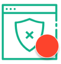

<p align="center">
  
</p>

<!-- <p align="center">
  <a href="https://www.npmjs.org/package/element-plus">
    
  </a>
  <a href="https://npmcharts.com/compare/element-plus?minimal=true">
    
  </a>
  <a href="https://codecov.io/gh/element-plus/element-plus">
    
  </a>
  <br>
</p> -->

# site-blocker
Hi! Welcome to this project!😙  

I'm currently working on it. Please leave an issue if you think there could be any improvement. Appreciate it! 😋

## Project setup
```
npm install
```

### Compiles and hot-reloads for development
```
npm run serve
```

### Compiles and minifies for production
```
npm run build
```

### Lints and fixes files
```
npm run lint
```

### Customize configuration
See [Configuration Reference](https://cli.vuejs.org/config/).
